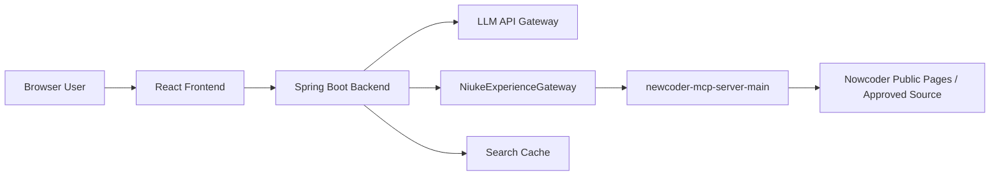

# 架构设计

## 总览

## 分层

### 前端

- React + TypeScript。
- 只调用后端 API，不直接访问牛客网或 MCP server。
- 负责搜索体验、结果展示、响应式布局和基础状态管理。

### 后端

- Spring Boot。
- 提供稳定业务 API。
- 通过 `NiukeExperienceGateway` 调用专属 MCP server。
- 负责去重、排序、缓存、错误兜底和后续大模型整理。

### 牛客 MCP server

- 独立进程，使用 MCP stdio 协议。
- 只暴露牛客面经搜索工具。
- 负责第三方来源访问、速率限制、来源链接、字段抽取和合规策略。

## 数据流

1. `POST /api/interview-experiences/search`
2. 后端校验请求并构造 MCP tool 参数。
3. 后端调用 `nowcoder_search`，参数使用 `type=discuss` 和 `response_format=json`。
4. MCP server 返回结构化 JSON。
5. 后端统一为 API DTO 并返回前端。

## 关键边界

- MCP server 是牛客数据获取的唯一出口。
- 后端只依赖网关接口，不关心牛客页面结构。
- 前端不持有任何第三方站点访问细节。
- 大模型整理只处理后端标准化后的摘要数据。

## 后续扩展

- 增加岗位画像和技术栈同义词扩展。
- 增加搜索结果缓存和索引。
- 增加用户收藏、复习计划和题单进度。
- 增加部署脚本和健康检查。
